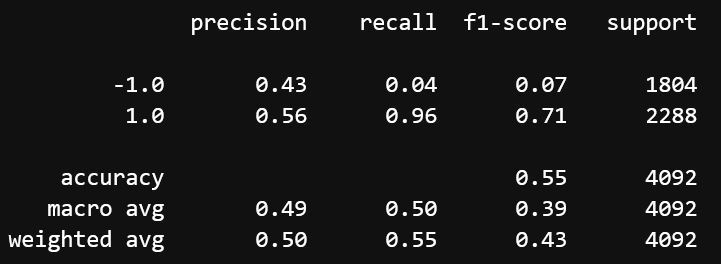
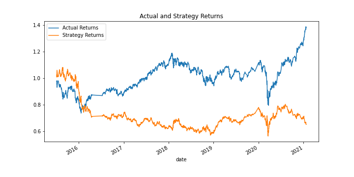
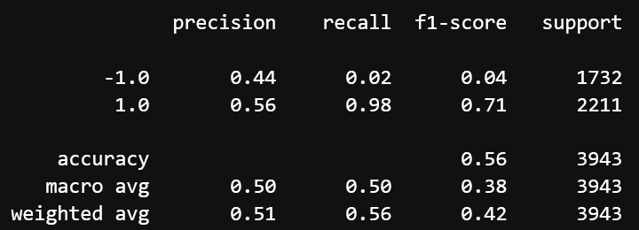
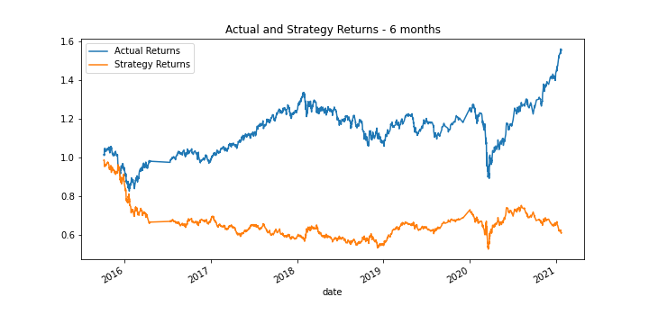
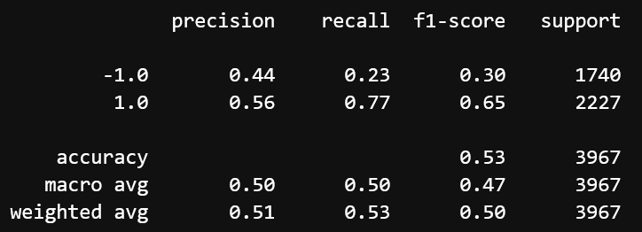
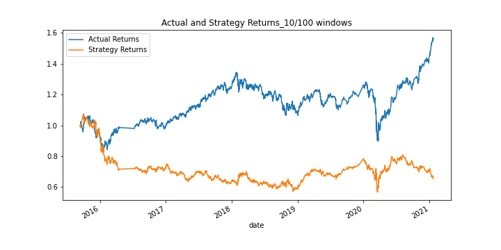
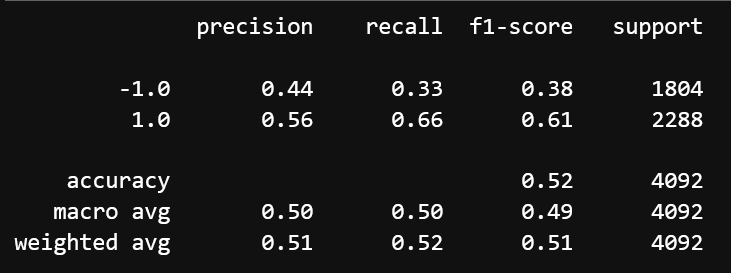
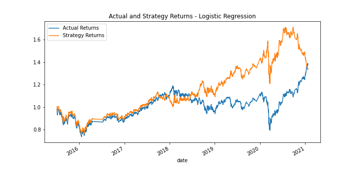

# Machine Learning Trading Bot

This **Jupyter notebook** project aims to improve an existing algorithmic trading system and enhance the existing trading signals with machine learning algorithms that can adapt to new data.

---

# Evaluation Report

## Establishing a Baseline Model

We start the evaluation using the **Support Vector Machine (SVM)** where we get the following classification report and plot:

We can see that recall is very high for 1 values and very low for -1 values which means that the model is doing well when predicting signal to buy stock, long position. However, the model fails when predicting signal to sell stock, short position.

## Tuning the Baseline Trading Algorithm

When we tune the algorithm by increasing the size of the training window, we get the following classification report and plot:

By increasing the size of the taining window we get very similar results. The accuracy is a bit higher but on the other hand the recall for -1 values is even lower than before.

## Tuning the Trading Algorithm by adjusting the SMA input feature

After adjusting the **short window** to 10 days, we get the following classification report and plot:

By adjusting the SMA input feature, we do get slightly better results. Even though the accuracy went down a bit, the recall for -1 values is much higher.

## Evaluating a New Machine Classifier

When we use **Logistic Regression** model, we get the following classification report and plot:

After reviewing model using Logistic Regression classifier, we can see improvement in predicting recall for -1 values and that is where our other models performed poorly. Looking at the plot we can observe the improvement as well. 

We can say that using Linear Regression model brings more accurate predictions than SVM model.

---

## Technologies

For this project we use the following tools:

* [JupyterLab](https://github.com/jupyterlab/jupyterlab) - an extensible environment for interactive and reproducible computing, based on the Jupyter Notebook and Architecture

* [pandas](https://github.com/pandas-dev/pandas) - is a Python package that provides fast, flexible, and expressive data structures designed to make working with "relational" or "labeled" data both easy and intuitive 

* [NumPy](https://numpy.org/doc/stable/user/absolute_beginners.html) - can be used to perform a wide variety of mathematical operations on arrays

* [pathlib](https://www.delftstack.com/howto/python/set-file-path-python/) - to Specify the File Path 

* [hvplot](https://hvplot.holoviz.org/) - hvPlot provides an alternative for the static plotting API provided by Pandas and other libraries

* [matplotlib.pyplot](https://matplotlib.org/3.5.0/tutorials/introductory/pyplot.html) - a collection of functions that make matplotlib work like MATLAB

* [Scikit-learn](https://scikit-learn.org/stable/) - is widely used for classification, predictive analytics, and very many other machine learning tasks

---

## Contributors

Author: Magdalena Svimberska
email: magdalena.svimberska@gmail.com

---

## License

GNU General Public License